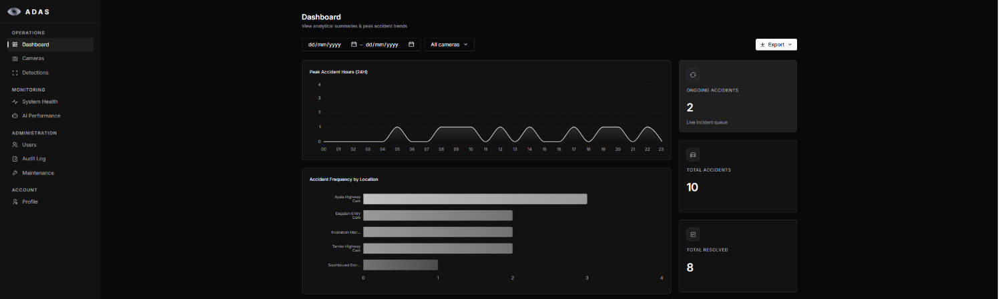
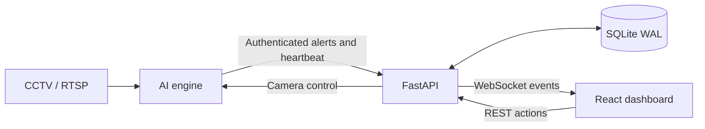

<p align="center">
  
</p>

<h1 align="center">ADAS</h1>
<p align="center"><strong>Intelligent Real-Time Road Accident Detection &amp; Alert System</strong></p>
<p align="center">RTSP video analysis · Human-reviewed alerts · Local operation</p>

<p align="center">
  <a href="https://github.com/bayie27/adas-capstone/actions/workflows/ci.yml"></a>
  
  
  
</p>

<p align="center">
  <a href="#quick-start">Quick start</a> ·
  <a href="docs/README.md">Documentation</a> ·
  <a href="docs/architecture/README.md">Architecture</a> ·
  <a href="CONTRIBUTING.md">Contributing</a>
</p>

ADAS analyzes CCTV streams for potential vehicle collisions and brings detections to an operator for confirmation, dismissal or clearance. A Python detection engine, FastAPI backend and React dashboard run as independently managed components on a local network.



_Illustrative dashboard capture from the Help Center. It retains the earlier “Resolved” label; the current application uses “Cleared.” Values shown are not evaluation results._

## What it does

- **Detect and deliver:** RTSP ingestion, YOLO inference, temporal evidence accumulation, snapshots and durable alert retries.
- **Keep people in control:** real-time alerts, confirm/dismiss/clear actions, shared snoozes and camera pause/resume coordination.
- **Support operations:** camera management, incident history, analytics, CSV/PDF exports and asynchronous export jobs.
- **Manage access and recovery:** revocable cookie sessions, role-based access, append-only audit, backup/restore and system-health telemetry.

## How it fits together



The engine pauses ingestion for a camera after detection; the backend and operator workflow coordinate what happens next. See [current architecture and contracts](docs/architecture/README.md) for transaction, session and recovery boundaries.

## Quick start

Install **Python 3.12.13**, **uv**, **Node.js 22+**, **pnpm** (the version in `package.json`) and **PowerShell** for the Windows launcher. Run these commands from the repository root in a fresh checkout:

```powershell
uv sync
pnpm install
Copy-Item .env.example .env
```

Configure the required secrets and `DEFAULT_ADMIN_PASSWORD` in `.env`. Then start the backend and frontend:

```powershell
pwsh -File scripts/start-dev.ps1
```

Open [localhost:5173](http://localhost:5173). For a disposable demonstration database, follow the [seed profiles and development-panel guide](docs/operations/README.md#the-dev-panel--reseed-fire-incidents-and-switch-accounts-without-restarting-anything). Reseeding replaces existing development data.

For actual video detection, install the AI extra and configure camera streams. Simulated streams additionally require MediaMTX, ffmpeg and separately supplied clips:

```powershell
uv sync --extra ai
uv run python ai_engine/main.py
```

Use `--extra ai-cpu` instead on a machine without an NVIDIA GPU; it supports integration work, not a validated throughput claim. Model selection, GPU options, simulation setup and LAN/TLS instructions are in the [operations guide](docs/operations/README.md) and [AI engine guide](ai_engine/README.md).

## Explore the repository

| Area                                                      | Start here                                |
| --------------------------------------------------------- | ----------------------------------------- |
| Setup, camera simulation, troubleshooting and maintenance | [Operations](docs/operations/README.md)   |
| Two-machine LAN/TLS setup                                 | [LAN guide](docs/operations/LAN_SETUP.md) |
| Detection, GPU paths and evaluation                       | [AI engine](ai_engine/README.md)          |
| API, persistence and backend tooling                      | [Backend](backend/README.md)              |
| Dashboard structure and frontend development              | [Frontend](frontend/README.md)            |
| Tests and validation references                           | [Validation](docs/validation/README.md)   |
| Commands, migrations and contribution checks              | [Contributing](CONTRIBUTING.md)           |
| Historical decisions and implementation evidence          | [Archive](docs/archive/README.md)         |
| Keeping the defense document aligned                      | [Paper sync](paper_sync/PROCEDURE.md)     |

## Project team

Enjey Kashlee M. Alonzo · Sebastian Angelo T. Meer · Daniel Luis P. Sahagun · Jhon Paulo H. Tenorio

De La Salle Lipa — Bachelor of Science in Information Technology, College of Information Technology and Engineering.
