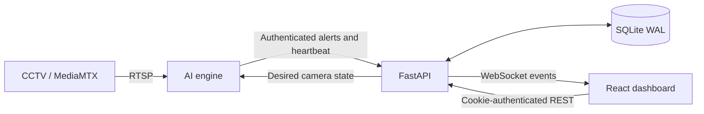

# Architecture and current contracts

ADAS has three independently runnable components: an RTSP detection worker, a FastAPI backend and a React dashboard. This guide describes current boundaries; schemas, services and tests define the detailed executable contracts. Read [repository conventions](../../CLAUDE.md) before changing them.

## Ownership and transactions

Routes authorize and serialize; services own domain rules and transactions. The AI worker owns frame ingestion, inference, temporal accumulation and durable delivery. The backend owns operator decisions, camera desired state, sessions, audit and persistence. The frontend owns presentation and user interaction (D-001, D-003, D-012).

Primary audited changes and their audit rows commit together. Failure/denial records follow rollback in a separate transaction. WebSocket delivery follows committed state. SQLite WAL supports concurrent readers and a writer; it does not eliminate contention. Stored timestamps use `UtcDateTime` and aware UTC values (D-005, D-007, D-008).

Schema changes use Alembic. Production startup rejects a revision mismatch; development warns. Never replace migrations with application `create_all()` calls. See [migration workflow](../../CONTRIBUTING.md#database-migrations).

## Incidents and camera control

The current incident lifecycle is `Unverified → Ongoing → Cleared`, with `Unverified → Dismissed` and `Ongoing → Dismissed` correction paths. Dismissal from Unverified introduces the configured cooldown; correction from Ongoing resumes immediately. The partial unique index enforces at most one open incident per camera (D-002).

On detection, the worker pauses its own camera ingestion before an operator acts. The backend mirrors that pause and broadcasts it. Heartbeat reconciliation separates backend-owned desired state from worker-observed state. Shared snooze state belongs to the incident; alarm preferences belong to each user (D-003, D-004).

## Authentication, API and real-time boundaries

Sessions use HttpOnly cookies backed by revocable database sessions; JavaScript does not store session credentials. REST and WebSocket handshakes use the same session authority. Internal worker endpoints use `INTERNAL_API_KEY` authentication (D-006).

Use [backend schemas](../../backend/app/schemas/) and the running backend's `/docs` for current payload details. Services enforce authorization and state transitions. Versioned WebSocket events update dashboard state; reconnection/revalidation handles missed events (D-008).

Unauthenticated health probes, authenticated hardware telemetry and maintenance are separate routers by design (D-009). Reports share filters and sorting with list views, with persisted jobs for asynchronous exports (D-010).

## Maintenance and detection constraints

Backups and archives use verified protected storage when available, otherwise report a degraded local tier. Restore is a durable audited request executed by the maintenance coordinator, with verification and recovery. Keep restart scheduling distinct from in-process daily backup scheduling (D-011).

The engine defaults to `epoch50.pt`, allows explicit model selection and fails if the selected artifact is unavailable. Production uses a fixed 15 FPS scheduling target; measured throughput is not a guarantee of that rate. The optional capacity diagnostic never configures production. Preserve detector confidence, accumulator parity, four reset seams and GPU conversion arithmetic (D-012).

## Historical rationale

The [decision review](../archive/be_decisions_review.md) records D-001–D-012; the [historical contracts](../archive/be_plan/01_CONTRACTS.md) preserve original implementation specifications. They are provenance, not instructions to recreate old behavior. In particular, historical `Resolved` terminology is now `Cleared`, and pre-migration development instructions no longer apply. Current code, migrations and tests must substantiate any claimed behavior.

See [AI technical documentation](../../ai_engine/README.md), [operations](../operations/README.md) and [validation](../validation/README.md).

The [repository layout](repository-layout.md) maps the main modules and entrypoints.
